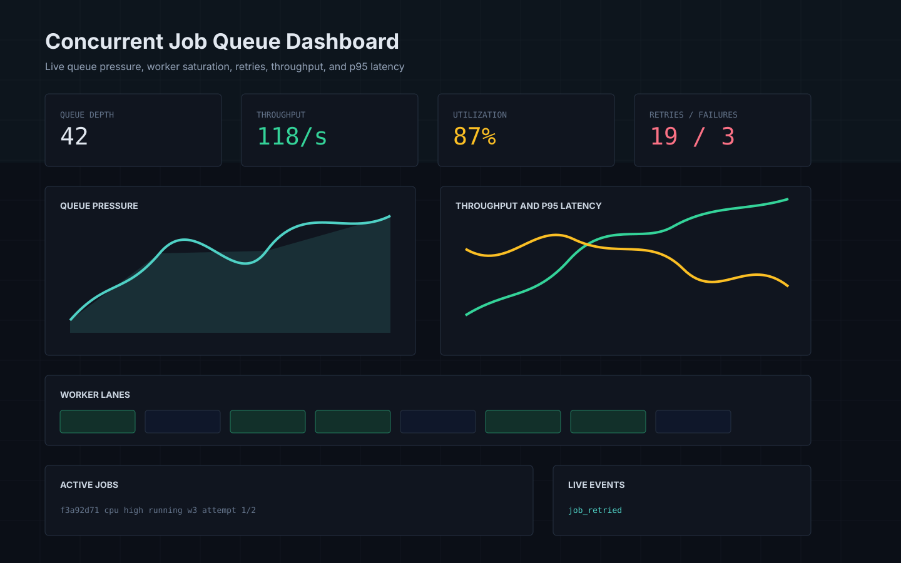
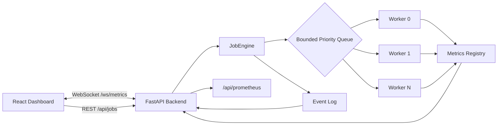
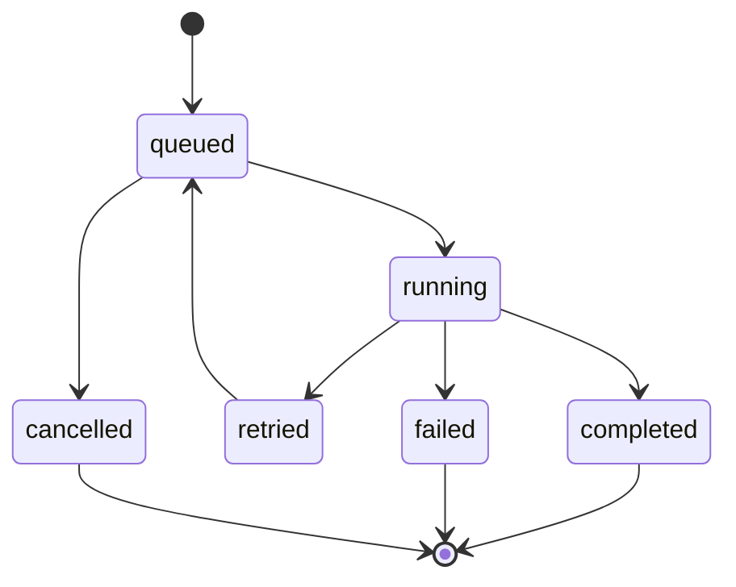

# Concurrent Job Queue Dashboard

Production-style observability dashboard for a bounded concurrent job processing engine. The project is intentionally focused on systems programming concerns: backpressure, worker utilization, queue contention, retries, latency, throughput, and real-time operational visibility.



## What This Is

This is not a CRUD dashboard. It is a lightweight control and observability surface for a backend infrastructure service:

- FastAPI backend with a fixed-size threaded worker pool.
- Thread-safe bounded priority queue with blocking backpressure.
- CPU, I/O, and delayed simulated jobs.
- Retry lifecycle with failed/retried/completed states.
- WebSocket metrics stream for live dashboards.
- React + TypeScript + Tailwind frontend.
- Benchmark CLI for serial vs concurrent execution.
- Dockerized local development setup.
- Prometheus-compatible metrics endpoint.

## Project Structure

```text
.
├── backend/
│   ├── app/
│   │   ├── api/routes/          # REST routes for jobs, metrics, Prometheus
│   │   ├── core/                # config and structured logging
│   │   ├── models/              # job state, priority, lifecycle models
│   │   ├── services/            # job engine, metrics registry, WebSocket manager
│   │   └── main.py              # FastAPI app lifecycle
│   ├── benchmarks/
│   │   └── run_benchmark.py     # CLI benchmark mode
│   ├── Dockerfile
│   └── requirements.txt
├── frontend/
│   ├── src/
│   │   ├── components/          # metrics cards, charts, worker lanes, logs
│   │   ├── lib/                 # API client and WebSocket hook
│   │   ├── pages/
│   │   └── types/
│   ├── Dockerfile
│   └── package.json
├── docs/
│   └── mock-dashboard.svg
├── docker-compose.yml
└── .env.example
```

## Architecture



## Job Lifecycle



## Run With Docker

```bash
docker compose up --build
```

Open:

- Dashboard: [http://localhost:5173](http://localhost:5173)
- API docs: [http://localhost:8000/docs](http://localhost:8000/docs)
- Prometheus metrics: [http://localhost:8000/api/prometheus](http://localhost:8000/api/prometheus)

## Run Locally

Backend:

```bash
cd backend
python -m venv .venv
.\.venv\Scripts\Activate.ps1
pip install -r requirements.txt
uvicorn app.main:app --reload --host 0.0.0.0 --port 8000
```

Frontend:

```bash
cd frontend
npm install
npm run dev
```

## Configuration

Environment variables use the `CJQD_` prefix.

| Variable | Default | Meaning |
| --- | ---: | --- |
| `CJQD_WORKER_COUNT` | `4` | Fixed worker thread count |
| `CJQD_QUEUE_CAPACITY` | `128` | Maximum queued jobs before producers block |
| `CJQD_ENQUEUE_TIMEOUT_SECONDS` | `2.0` | API wait time before returning HTTP 429 |
| `CJQD_RETRY_DELAY_SECONDS` | `1.0` | Delay before retried jobs re-enter the queue |
| `CJQD_DEFAULT_MAX_RETRIES` | `2` | Default retry budget per job |
| `CJQD_METRICS_INTERVAL_SECONDS` | `1.0` | WebSocket snapshot interval |
| `CJQD_HISTORY_LIMIT` | `256` | Retained in-memory event count |

## API Examples

Create a burst:

```bash
curl -X POST "http://localhost:8000/api/jobs/burst?count=64&duration_ms=250"
```

Create a high-priority CPU job:

```bash
curl -X POST "http://localhost:8000/api/jobs" \
  -H "Content-Type: application/json" \
  -d '{"job_type":"cpu","priority":"high","duration_ms":500,"failure_rate":0.1}'
```

Fetch a metrics snapshot:

```bash
curl http://localhost:8000/api/metrics
```

## Benchmark Mode

Run the backend benchmark CLI:

```bash
cd backend
python benchmarks/run_benchmark.py --max-workers 8 --output benchmark-report.json
```

The benchmark reports:

- Serial execution time.
- Concurrent execution time.
- Speedup by worker count.
- Throughput in jobs/sec.
- Average and p95 job latency.

A small generated example report is included at `docs/sample-benchmark-report.json`.

## Metrics Explained

| Metric | Why It Matters |
| --- | --- |
| Queue depth | Indicates queue pressure and producer/consumer imbalance |
| Peak queue size | Shows maximum observed backlog under load |
| Throughput | Measures completed jobs per second |
| Worker utilization | Shows whether the pool is saturated or idle |
| p95 latency | Captures tail behavior hidden by averages |
| Retries/failures | Exposes instability and retry amplification |
| Active jobs | Shows currently queued/running/retried work |

## Systems Discussion

The queue is protected by a lock inside Python's `queue.PriorityQueue`. That makes correctness and shutdown semantics straightforward, but the shared queue is a contention point. Every producer and every worker coordinates through the same structure.

The bounded queue is deliberate. Without a bound, a fast producer can allocate unbounded memory and push overload downstream. With blocking backpressure, overload is surfaced to producers. The API eventually returns `429` if it cannot enqueue within the configured timeout.

Task granularity matters. Very small tasks are dominated by scheduling overhead, queue locking, wakeups, and context switches. Larger tasks amortize that overhead better, but they can increase tail latency and reduce fairness.

Retries are useful but dangerous. A failing downstream dependency can create retry amplification, increasing queue pressure exactly when the system is already unhealthy. The dashboard makes that visible through retry counts, queue depth, and p95 latency.

## Bonus Features Included

- Prometheus text export at `/api/prometheus`.
- Task cancellation for queued jobs.
- Priority scheduling.
- Persistent in-memory job history for recent jobs and events.

## Possible Next Steps

- Redis-backed queue mode for multi-process deployments.
- Per-worker queues with work stealing.
- Durable job history in Postgres.
- Distributed tracing spans per job.
- Admission control based on latency or queue depth.
- Real Prometheus client integration with histograms.
